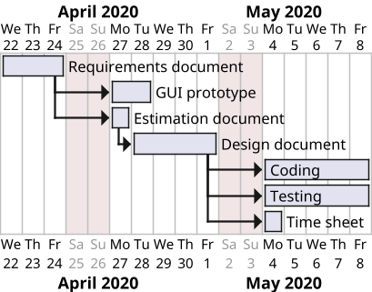

# Project Estimation

Authors: Group 12

Date: 22/04/2020

Version: 1.0

# Contents

- [Estimation approach](#estimation-approach)
- [Estimate by product decomposition](#estimate-by-product-decomposition)
- [Estimate by activity decomposition](#estimate-by-activity-decomposition)
    + [Gantt diagram](#gantt-diagram)

# Estimation approach

As described in the glossary in the requirements document, we suppose to have about 10 classes (at least the most important ones).

The project will be implemented using the Spring framework, so functionalities and data from each class will be splitted among many classes or interfaces in different modules.

We have not considered all those design details in these estimations, but classes (as taken from the glossary) have an higher number of LOC as they implement all functionalities and data.

# Estimate by product decomposition

###

|             | Estimate                        |
| ----------- | ------------------------------- |
| NC =  Estimated number of classes to be developed   | 10 |
| A = Estimated average size per class, in LOC        | 200 |
| S = Estimated size of project, in LOC (= NC * A) | 200 |
| E = Estimated effort, in person hours (here use productivity 10 LOC per person hour)  | 2000 / 10 = 200 |
| C = Estimated cost, in euro (here use 1 person hour cost = 30 euro) | 200 * 30 = 6000 |
| Estimated calendar time, in calendar weeks (Assume team of 4 people, 8 hours per day, 5 days per week ) | 1.25 (about 1 week and 2 days) |

# Estimate by activity decomposition

|         Activity name    | Estimated effort (person hours)   |
| ----------- | ------------------------------- |
| Requirements document | 80 |
| GUI prototype | 50 |
| Estimation document | 10 |
| Design document | 80 |
| Coding | 120 |
| Testing | 120 |

## Gantt diagram

