# Project Estimation

Authors: Group 12

Date: 22/04/2020

Version: 1.0

# Contents

- [Estimation approach](#estimation-approach)
- [Estimate by product decomposition](#estimate-by-product-decomposition)
- [Estimate by activity decomposition](#estimate-by-activity-decomposition)
    + [Gantt diagram](#gantt-diagram)

# Estimation approach

<!-- This is a formal approach. We can assume there are four main activities to end the project: requirements, design, coding, testing.
As we don't know how much time each activity could take, we can consider a uniformal distribution among them. So, the effort for each activity will be the same:

```
requirements effort = design effort = coding effort = testing effort
```

This project is quite small, so one module is enough to contain all parts. In this case, we do not have to perform the same activity more times. The overall project effort needed is:

```
overall effort = (requirements effort + design effort + coding effort + testing effort) * number of modules = coding effort * 4 * 1
```

The easiest effort to compute is the coding effort. We can assume we need 10 classes, each class is 120 LOC.

We also suppose a person can produce about 10 LOC per hour. These values considers writing requirements, designing, coding and testing (all the 4 main activities for the project). It is important that, computing the overall project effort, we consider not only the coding time, but even requirements, design and testing times.
-->

# Estimate by product decomposition

###

|             | Estimate                        |
| ----------- | ------------------------------- |
| NC =  Estimated number of classes to be developed   | 21 |
| A = Estimated average size per class, in LOC        | 100 |
| S = Estimated size of project, in LOC (= NC * A) | 2100 |
| E = Estimated effort, in person hours (here use productivity 10 LOC per person hour)  | 2100 / 10 = 210 |
| C = Estimated cost, in euro (here use 1 person hour cost = 30 euro) | 210 * 30 = 6300 |
| Estimated calendar time, in calendar weeks (Assume team of 4 people, 8 hours per day, 5 days per week ) | 2 |


# Estimate by activity decomposition

|         Activity name    | Estimated effort (person hours)   |
| ----------- | ------------------------------- |
| Requirements document | 80 |
| GUI prototype | 50 |
| Estimation document | 10 |
| Design document | 80 |
| Coding | 120 |
| Testing | 120 |

## Gantt diagram

```plantuml
@startgantt

Project starts the 2020/04/06

saturday are closed
sunday are closed
2020/04/13 is closed

[Requirements document] lasts 3 days
[GUI prototype] lasts 2 days
[Estimation document] lasts 1 days
[Design document] lasts 4 days
[Code] lasts 5 days
[Test cases] lasts 5 days
[Time sheet] lasts 1 days


[GUI prototype] starts at [Requirements document]'s end
[Estimation document] starts at [Requirements document]'s end
[Design document] starts at [Estimation document]'s end
[Code] starts at [Design document]'s end
[Test cases] starts at [Design document]'s end
[Time sheet] starts at [Design document]'s end

@endgantt
```



