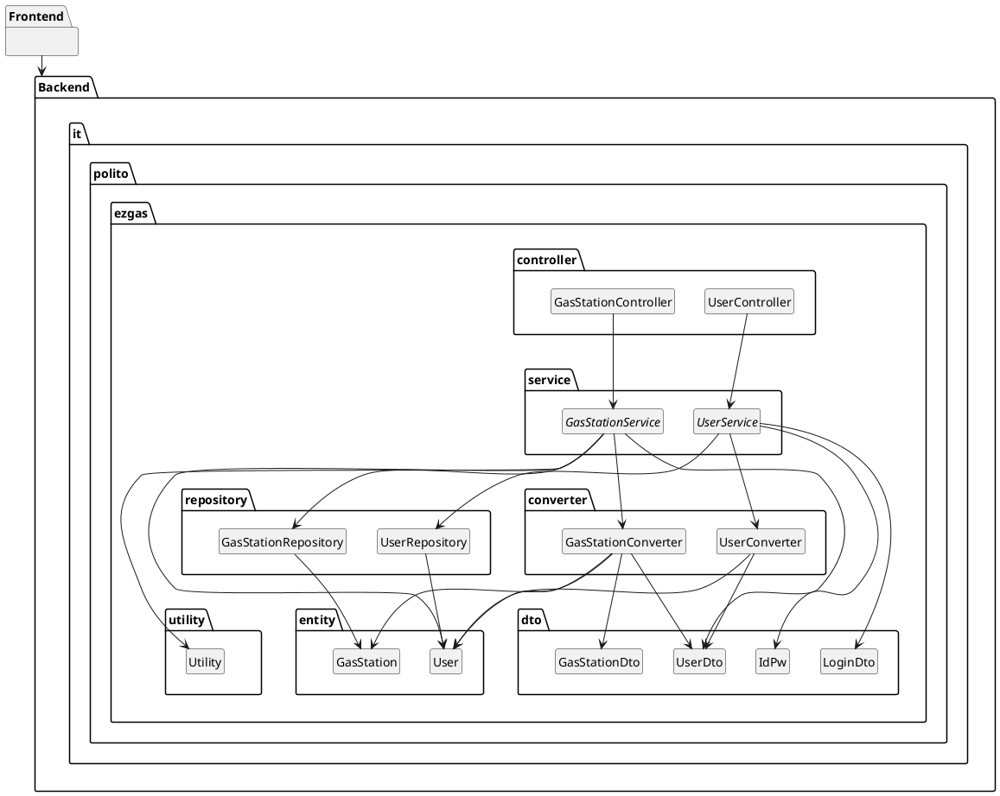

# Integration and API Test Documentation

Authors: Group 12

Date: 21/05/2020

Version: 2.0

# Contents

- [Dependency graph](#dependency-graph)

- [Integration approach](#integration)

- [Tests](#tests)

- [Scenarios](#scenarios)

- [Coverage of scenarios and FR](#scenario-coverage)
- [Coverage of non-functional requirements](#nfr-coverage)

# Dependency graph

# Integration approach

We adopted the MIXED way for the integration tests. We used the bottom-up approach for the Converter - Service, and the top-down approach for the Repository - Service.

Sequence:

- step1:  GasStationTest.java + UserTest.java +
        GasStationDtoTest.java + UserDtoTest.java

- step2:  GasStationConverterTest.java + UserConverterTest.java +
        GasStationRepositoryTest.java + UserRepositoryTests.java

- stepN:  GasStationServiceTest.java + UserServiceTest.java

#  Tests

   <define below a table for each integration step. For each integration step report the group of classes under test, and the names of
     JUnit test cases applied to them>

## Step 1
| Classes  | JUnit test cases |
|--|--|
| GasStationTest.java | constructor__returnGasStation |
| GasStationTest.java | getGasStationId__returnGasStationId |
| GasStationTest.java | setGasStationId__modifyGasStationId |
| GasStationTest.java | getGasStationName__returnGasStationName |
| GasStationTest.java | setGasStationName__modifyGasStationName |
| GasStationTest.java | getGasStationAddress__returnGasStationAddress |
| GasStationTest.java | setGasStationAddress__modifyGasStationAddress |
| GasStationTest.java | getReportDependability__returnReportDependability |
| GasStationTest.java | setReportDependability__modifyReportDependability |
| GasStationTest.java | getReportUSer__returnReportUser |
| GasStationTest.java | setReportUSer__modifyReportUser |
| GasStationTest.java | getReportTimestamp__returnReportTimestamp |
| GasStationTest.java | setReportTimestamp__modifyReportTimestamp |
| GasStationTest.java | getHasDiesel__returnHasDiesel |
| GasStationTest.java | setHasDiesel__modifyHasDiesel |
| GasStationTest.java | getHasSuper__returnHasSuper |
| GasStationTest.java | setHasSuper__modifyHasSuper |
| GasStationTest.java | getHasSuperPlus__returnHasSuperPlus |
| GasStationTest.java | setHasSuperPlus__modifyHasSuperPlus |
| GasStationTest.java | getHasGas__returnHasGas |
| GasStationTest.java | setHasGas__modifyHasGas |
| GasStationTest.java | getHasMethane__returnHasMethane |
| GasStationTest.java | setHasMethane__modifyHasMethane |
| GasStationTest.java | getLat__returnLat |
| GasStationTest.java | setLat__modifyLat |
| GasStationTest.java | getLon__returnLon |
| GasStationTest.java | setLon__modifyLon |
| GasStationTest.java | getDieselPrice__returnDieselPrice |
| GasStationTest.java | setDieselPrice__modifyDieselPrice |
| GasStationTest.java | getSuperPrice__returnSuperPrice |
| GasStationTest.java | setSuperPrice__modifySuperPrice |
| GasStationTest.java | getSuperPlusPrice__returnSuperPlusPrice |
| GasStationTest.java | setSuperPlusPrice__modifySuperPlusPrice |
| GasStationTest.java | getGasPrice__returnGasPrice |
| GasStationTest.java | setGasPrice__modifyGasPrice |
| GasStationTest.java | getMethanePrice__returnMethanePrice |
| GasStationTest.java | setMethanePrice__modifyMethanePrice |
| GasStationTest.java | getUser__returnUser |
| GasStationTest.java | setUser__modifyUser |
| GasStationTest.java | getCarSharing__returnCarSharing |
| GasStationTest.java | setCarSharing__modifyCarSharing |
| UserTest.java       | testUser_ShouldCreateObject |
| UserTest.java       | testGetUserId_ShouldReturnUserId |
| UserTest.java       | testSetUserId_ShouldSetUserId |
| UserTest.java       | testGetUserName_ShouldReturnUserName |
| UserTest.java       | testSetUserName_ShouldSetUserName |
| UserTest.java       | testGetPassword_ShouldReturnPassword |
| UserTest.java       | testSetPassword_ShouldSetPassword |
| UserTest.java       | testGetEmail_ShouldReturnEmail |
| UserTest.java       | testSetEmail_ShouldSetEmail |
| UserTest.java       | testGetReputation_ShouldReturnReputation |
| UserTest.java       | testSetReputation_ShouldSetReputation |
| UserTest.java       | testGetAdmin_ShouldReturnAdmin |
| UserTest.java       | testSetAdmin_ShouldSetAdmin |
| GasStationDtoTest.java | setHasSuper_ShouldHaveUpdateValue |
| GasStationDtoTest.java | setHasSuperPlus_ShouldHaveUpdateValue |
| GasStationDtoTest.java | setHasGas_ShouldHaveUpdateValue |
| UserDtoTest.java       | notInitializedAdmin_ShouldBeFalse |

## Step 2
| Classes  | JUnit test cases |
|--|--|
| GasStationConverterTest.java  | testGasStationConvertToGasStationDto  |
| GasStationConverterTest.java  | testGasStationDtoConvertToGasStation  |
| UserConverterTest.java        | testUserConvertToUserDto              |
| UserConverterTest.java        | testUserDtoConvertToUser              |
| GasStationRepositoryTest.java | testFindByGasStationId                                    |
| GasStationRepositoryTest.java | testFindByHasMethaneTrueOrderByMethanePriceDesc           |
| GasStationRepositoryTest.java | testFindByCarSharing                                      |
| GasStationRepositoryTest.java | testFindByHasDieselTrueOrderByDieselPriceDesc             |
| GasStationRepositoryTest.java | testFindByHasSuperTrueOrderBySuperPriceDesc               |
| GasStationRepositoryTest.java | testFindByHasSuperPlusTrueOrderBySuperPlusPriceDesc       |
| GasStationRepositoryTest.java | testFindByHasGasTrueOrderByGasPriceDesc                   |
| UserRepositoryTests.java      | testFindByEmailAndPassword                                |
| UserRepositoryTests.java      | testFindByUserId                                          |

## Step n API Tests

| Classes  | JUnit test cases |
|--|--|
| GasStationServiceTest.java    | existingId_returnCorrespondingGasStationDto  |
| GasStationServiceTest.java    | nonExistingId_returnNull  |
| GasStationServiceTest.java    | negativeId_InvalidGasStationExceptionThrown  |
| GasStationServiceTest.java    | existingId_returnCorrespondingGasStationDtoWithUserAndTimestampInserted  |
| GasStationServiceTest.java    | validGasStationDto_returnGasStationDto  |
| GasStationServiceTest.java    | negativeDiesel_PriceExceptionThrown  |
| GasStationServiceTest.java    | negativeSuper_PriceExceptionThrown  |
| GasStationServiceTest.java    | negativeSuperPlusPrice_PriceExceptionThrown  |
| GasStationServiceTest.java    | negativeGasPrice_PriceExceptionThrown  |
| GasStationServiceTest.java    | negativeMethanePrice_PriceExceptionThrown  |
| GasStationServiceTest.java    | invalidLatitude_GPSDataExceptionThrown  |
| GasStationServiceTest.java    | invalidLongitude_GPSDataExceptionThrown  |
| GasStationServiceTest.java    | _returnEmptyList  |
| GasStationServiceTest.java    | _returnGasStationDtoList  |
| GasStationServiceTest.java    | existingId_returnTrue  |
| GasStationServiceTest.java    | nonExistingId_returnFalse  |
| GasStationServiceTest.java    | negativeId_InvalidGasStationExceptionThrown  |
| GasStationServiceTest.java    | diesel_returnListGasStationDtoSortedByPrice  |
| GasStationServiceTest.java    | super_returnListGasStationDtoSortedByPrice  |
| GasStationServiceTest.java    | superPlus_returnListGasStationDtoSortedByPrice  |
| GasStationServiceTest.java    | gas_returnListGasStationDtoSortedByPrice  |
| GasStationServiceTest.java    | methane_returnListGasStationDtoSortedByPrice  |
| GasStationServiceTest.java    | diesel_returnEmptyList  |
| GasStationServiceTest.java    | emptyString_InvalidGasTypeExceptionThrown  |
| GasStationServiceTest.java    | null_InvalidGasTypeExceptionThrown  |
| GasStationServiceTest.java    | invalidString_InvalidGasTypeExceptionThrown  |
| GasStationServiceTest.java    | invalidLatValidLon_GPSDataExceptionThrown  |
| GasStationServiceTest.java    | validLatInvalidLon_GPSDataExceptionThrown  |
| GasStationServiceTest.java    | invalidLatInvalidLon_GPSDataExceptionThrown  |
| GasStationServiceTest.java    | validLatValidLon_returnListGasStationDtoSortedByDistance  |
| GasStationServiceTest.java    | validLatValidLon_returnListEmptyList  |
| GasStationServiceTest.java    | dieselCarcompanyA_returnListGasStationDtoSortedByPrice  |
| GasStationServiceTest.java    | superCarcompanyB_returnListGasStationDtoSortedByPrice  |
| GasStationServiceTest.java    | dieselNonExistingCarCompany_returnEmptyList  |
| GasStationServiceTest.java    | wrongLat_throwGPSDataException  |
| GasStationServiceTest.java    | emptyGasolinetype_throwGPSDataException  |
| GasStationServiceTest.java    | validLatValidLonDieselCarA_returnGasStationListSortedByDistance  |
| GasStationServiceTest.java    | validLatValidLonNullCarA_returnGasStationListSortedByDistance  |
| GasStationServiceTest.java    | validLatValidLonNullNull_returnGasStationListSortedByDistance  |
| GasStationServiceTest.java    | validLatValidLonMethaneNull_returnGasStationListSortedByDistance  |
| GasStationServiceTest.java    | invalidUserId_ShouldThrowException  |
| GasStationServiceTest.java    | invalidGasStationId_ShouldThrowException  |
| GasStationServiceTest.java    | notExistingUser_ShouldThrowException  |
| GasStationServiceTest.java    | notExistingGasStation_ShouldThrowException  |
| GasStationServiceTest.java    | invalidGasTypePrice_ShouldThrowException  |
| GasStationServiceTest.java    | correctParams_ShouldSetNewReport  |
| GasStationServiceTest.java    | validCarSharing_ShouldReturnGasStationList  |
| GasStationServiceTest.java    | wrongCarSharing_ShouldReturnEmptyGasStationList  |
| UserServiceTest.java          | getUser_UserId_ShouldReturnUser  |
| UserServiceTest.java          | getUser_NotExistingUserId_ShouldThrowException  |
| UserServiceTest.java          | saveNewUser_ShouldHaveReputationEq0  |
| UserServiceTest.java          | saveTwoUser_ShouldNotHaveSameEmail  |
| UserServiceTest.java          | testDelete  |
| UserServiceTest.java          | testInvalidUserException  |
| UserServiceTest.java          | nonExistingId  |
| UserServiceTest.java          | _returnEmptyList  |
| UserServiceTest.java          | _returnUserDtoList  |
| UserServiceTest.java          | invalidEmail_ShouldThrowException  |
| UserServiceTest.java          | invalidPassword_ShouldThrowException  |
| UserServiceTest.java          | correctIdPw_ShouldReturnLogin  |
| UserServiceTest.java          | testMaxValueIncrease  |
| UserServiceTest.java          | testIncrease  |
| UserServiceTest.java          | testInvalidUserException  |
| UserServiceTest.java          | nonExistingId  |
| UserServiceTest.java          | testDecrease  |
| UserServiceTest.java          | testMinValueDecrease  |
| UserServiceTest.java          | testInvalidUserException  |
| UserServiceTest.java          | nonExistingId  |

# Scenarios

## Scenario UC1.1

| Scenario | Create User Account Fail | Technique | Coverage |
| -------- |:-------------------:|:---------:|:--------:|
|  Precondition     | Account U already exists |
|  Post condition   | No new account is added to the system |
| Step#             | Description  | Test created from Requirements | 100% |
|  1     |  User goes to the signup page |
|  2     |  User inserts his/her wanted credentials (Username, Email, Password) in the designated blank fields  |
|  3     |  User receives an error since a user with that email is already present in the database  |

## Scenario UC1.2

| Scenario | Create User Account Reputation Check | Technique | Coverage |
| -------- |:-------------------:|:---------:|:--------:|
|  Precondition     | Account U doesn't exist |
|  Post condition   | A new user with reputation 0 is added to the system |
| Step#             | Description  | Test created from Requirements | 100% |
|  1     |  User goes to the signup page |
|  2     |  User inserts his/her wanted credentials (Username, Email, Password) in the designated blank fields  |
|  3     |  A new User is created and inserted in the database with reputation 0  |

## Scenario UC1.3

| Scenario | List all Users Fail | Technique | Coverage |
| -------- |:-------------------:|:---------:|:--------:|
|  Precondition     | Multiple user accounts are in the database |
|  Post condition   | No user is retrieved |
| Step#             | Description  | Test created from Requirements | 100% |
|  1     | Admin logs in |
|  2     | Admin tries to list all the users present in the database |
|  3     | Admin receives an empty list instead of a full one |

## Scenario UC1.4

| Scenario | User ID not existing | Technique | Coverage |
| -------- |:-------------------:|:---------:|:--------:|
|  Precondition     | User to search is not in the database |
|  Post condition   | |
| Step#             | Description  | Test created for code coverage | 90.9% |
|  1     | Admin logs in |
|  2     | Admin tries to search for a user which is not in the database |
|  3     | An InvalidUserException is lauched |

## Scenario UC1.5

| Scenario | Invalid User Id | Technique | Coverage |
| -------- |:-------------------:|:---------:|:--------:|
|  Precondition     | User to search is not in the database |
|  Post condition   | |
| Step#             | Description  | Test created from Requirements | 41.2% |
|  1     | Admin logs in |
|  2     | Admin tries to search for a user which is not in the database and inserts a nevative id (not valid) |
|  3     | An InvalidUserException is lauched |

## Scenario UC4.1

| Scenario | NegativeGastypePrice test | Technique | Coverage |
| -------- |:-------------------:|:---------:|:--------:|
|  Precondition     | Specific GasStation is present in the database  |
|  Post condition   | No changes are done|
| Step#             | Description  | Test created from Requirements | 70% |
|  1     | Admin logs in |
|  2     | Admin tries to modify a price for a gas station inserting a negative price (not valid) |
|  3     | A PriceException is raised |

## Scenario UC4.2

| Scenario | Invalid latitude or longitude test | Technique | Coverage |
| -------- |:-------------------:|:---------:|:--------:|
|  Precondition     | User to search is not in the database |
|  Post condition   | |
| Step#             | Description  | Test created from Requirements | 69.6% |
|  1     | Admin logs in |
|  2     | Admin tries to create a new gas station inserting invalid latitude (<-90° or >90°) or an invalid longitude (<-180° or >180°) |
|  3     | A GPSDataException is raised |

## Scenario UC4.3

| Scenario | Invalid GasStationID | Technique | Coverage |
| -------- |:-------------------:|:---------:|:--------:|
|  Precondition     | Gas Station is not in the database |
|  Post condition   | |
| Step#             | Description  | Test created from Requirements | 18.2% |
|  1     | Admin logs in |
|  2     | Admin tries to search for a gas station having a negative id |
|  3     | An InvalidGasStationException is raised |

## Scenario UC4.4

| Scenario | getAllGasStation fail | Technique | Coverage |
| -------- |:-------------------:|:---------:|:--------:|
|  Precondition     | Multiple Gas Stations are in the database |
|  Post condition   | |
| Step#             | Description  | Test created for code coverage | 100% |
|  1     | Admin logs in |
|  2     | Admin tries to get the list of all gas stations present in the database |
|  3     | An error returns only an empty list |

## Scenario UC6.1

| Scenario | Non existing GasStationID | Technique | Coverage |
| -------- |:-------------------:|:---------:|:--------:|
|  Precondition     | Gas Station is not in the database |
|  Post condition   | |
| Step#             | Description  | Test created from Requirements | 76.5% |
|  1     | Admin logs in |
|  2     | Admin tries to search for a gas station with an ID which is not in the database |
|  3     | An InvalidGasStationException is raised |

## Scenario UC6.2

| Scenario | Non existing GasStationID | Technique | Coverage |
| -------- |:-------------------:|:---------:|:--------:|
|  Precondition     | Gas Station is not in the database |
|  Post condition   | |
| Step#             | Description  | Test created from Requirements | 76.5% |
|  1     | Admin logs in |
|  2     | Admin tries to search for a gas station with an ID which is not in the database |
|  3     | An InvalidGasStationException is raised |

## Scenario UC7.1

| Scenario | Report PriceExeption | Technique | Coverage |
| -------- |:-------------------:|:---------:|:--------:|
|  Precondition     | Gas Station is in the database |
|  Post condition   | |
| Step#             | Description  | Test created from Requirements | 10% |
|  1     | Admin logs in |
|  2     | Admin searches for a gas station, and tries to insert a negative new price |
|  3     | An PriceException is raised |

## Scenario UC8.1

This scenario is a grouping of multiple tests covering the same area: the return of an empty list instead of the list of gas stations that we were searching. This is why we have a list of different coverages for tests.

| Scenario | Search fail | Technique | Coverage |
| -------- |:-------------------:|:---------:|:--------:|
|  Precondition     | Gas Station(s) is(are) not in the database |
|  Post condition   | |
| Step#             | Description  | Test created for code coverage | |
|a|getGasStationsByProximity||78.8%|
|b|getGasStationsWithoutCoordinates||89.8%|
|c|getGasStationsByGasolineType||83.3%|
|d|getGasStationsByCarSharing||100%|
||||
|  1     | Admin logs in |
|  2     | Admin tries to search for a gas station with a certain characteristic (latitude and longitude, gasoline type, car sharing|
|  3     | An empty list is returned because there was an error |

## Scenario UC8.2

| Scenario | InvalidGasTypeException | Technique | Coverage |
| -------- |:-------------------:|:---------:|:--------:|
|  Precondition     | Gas Station is not in the database |
|  Post condition   | |
| Step#             | Description  | Test created from Requirements | 23.8% |
|  1     | Admin logs in |
|  2     | Admin tries to search for a gas station with a specific gas type (null, empty string or invalid string) |
|  3     | An InvalidGasTypeException is raised |

## Scenario UC10.3

| Scenario | IncreaseReputation MaxValue | Technique | Coverage |
| -------- |:-------------------:|:---------:|:--------:|
|  Precondition     | User2 has inserted a price list into a gas station and has already a reputation of 5|
|  Post condition   | No change in reputation|
| Step#             | Description  | Test created from Requirements | 68.8% |
|  1     | User1 searches for a gas station and evaluates the price list with a positive mark (prices are correct)|
|  2     | The user2 reputation is increased, but since it's already 5 it will stay at maximum still|

## Scenario UC10.4

| Scenario | DecreaseReputation MinValue | Technique | Coverage |
| -------- |:-------------------:|:---------:|:--------:|
|  Precondition     | User2 has inserted a price list into a gas station and has a reputation of -5|
|  Post condition   | No change in reputation|
| Step#             | Description  | Test created from Requirements | 68.8% |
|  1     | User1 searches for a gas station and evaluates the price list with a negative mark (prices are wrong) |
|  2     | The user2 reputation is decreased, but since it's already -5 it will stay at minimum still|

# Coverage of Scenarios and FR

<Report in the following table the coverage of  scenarios (from official requirements and from above) vs FR.
Report also for each of the scenarios the (one or more) API JUnit tests that cover it. >

| Scenario ID | Functional Requirements covered | JUnit  Test(s) |
| ----------- | ------------------------------- | ----------- |
|  ..         | FRx                             |             |
|  ..         | FRy                             |             |
| ...         |                                 |             |
| ...         |                                 |             |
| ...         |                                 |             |
| ...         |                                 |             |

# Coverage of Non Functional Requirements

<Report in the following table the coverage of the Non Functional Requirements of the application - only those that can be tested with automated testing frameworks.>

###

| Non Functional Requirement | Test name |
| -------------------------- | --------- |
|                            |           |

