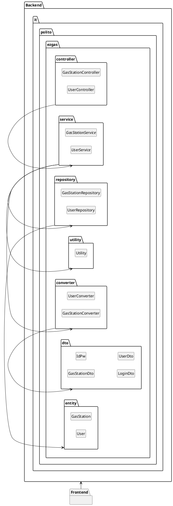

# Integration and API Test Documentation

Authors: Group 12

Date: 21/05/2020

Version: 1.0

# Contents

- [Dependency graph](#dependency graph)

- [Integration approach](#integration)

- [Tests](#tests)

- [Scenarios](#scenarios)

- [Coverage of scenarios and FR](#scenario-coverage)
- [Coverage of non-functional requirements](#nfr-coverage)

# Dependency graph

     <report the here the dependency graph of the classes in it/polito/Ezgas, using plantuml>

# Integration approach

    <Write here the integration sequence you adopted, in general terms (top down, bottom up, mixed) and as sequence
    (ex: step1: class A, step 2: class A+B, step 3: class A+B+C, etc)>
    <The last integration step corresponds to API testing at level of Service package>
    <Tests at level of Controller package will be done later>

#  Tests

   <define below a table for each integration step. For each integration step report the group of classes under test, and the names of
     JUnit test cases applied to them>

## Step 1
| Classes  | JUnit test cases |
|--|--|
|||

## Step 2
| Classes  | JUnit test cases |
|--|--|
|||

## Step n API Tests

   <The last integration step  should correspond to API testing, or tests applied to all classes implementing the APIs defined in the Service package>

| Classes  | JUnit test cases |
|--|--|
|||

# Scenarios

<If needed, define here additional scenarios for the application. Scenarios should be named
 referring the UC they detail>

## Scenario UCx.y

| Scenario |  name |
| ------------- |:-------------:|
|  Precondition     |  |
|  Post condition     |   |
| Step#        | Description  |
|  1     |  ... |
|  2     |  ... |

# Coverage of Scenarios and FR

<Report in the following table the coverage of  scenarios (from official requirements and from above) vs FR.
Report also for each of the scenarios the (one or more) API JUnit tests that cover it. >

| Scenario ID | Functional Requirements covered | JUnit  Test(s) |
| ----------- | ------------------------------- | ----------- |
|  ..         | FRx                             |             |
|  ..         | FRy                             |             |
| ...         |                                 |             |
| ...         |                                 |             |
| ...         |                                 |             |
| ...         |                                 |             |

# Coverage of Non Functional Requirements

<Report in the following table the coverage of the Non Functional Requirements of the application - only those that can be tested with automated testing frameworks.>

###

| Non Functional Requirement | Test name |
| -------------------------- | --------- |
|                            |           |

