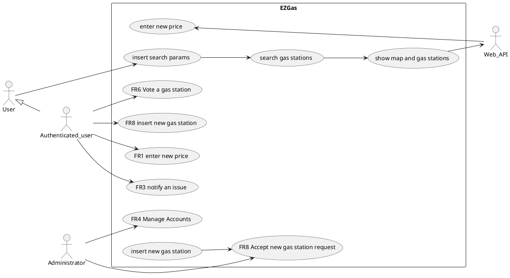
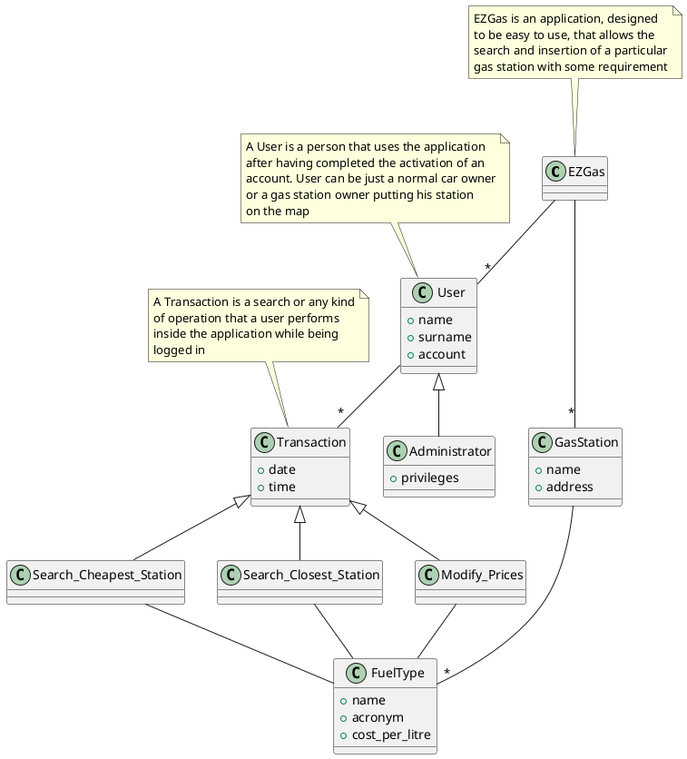

# Requirements Document

Authors: Group 12

Date: 08/04/2020

Version: 1

# Contents
- [Abstract](#abstract)
- [Stakeholders](#stakeholders)
- [Context Diagram and interfaces](#context-diagram-and-interfaces)
	+ [Context Diagram](#context-diagram)
	+ [Interfaces](#interfaces)

- [Stories and personas](#stories-and-personas)
- [Functional and non functional requirements](#functional-and-non-functional-requirements)
	+ [Functional Requirements](#functional-requirements)
	+ [Non functional requirements](#non-functional-requirements)
- [Use case diagram and use cases](#use-case-diagram-and-use-cases)
	+ [Use case diagram](#use-case-diagram)
	+ [Use cases](#use-cases)
    	+ [Relevant scenarios](#relevant-scenarios)
- [Glossary](#glossary)
- [System design](#system-design)
- [Deployment diagram](#deployment-diagram)

# Abstract

*Gas station* positions are very important for *drivers*, expecially for who travels a lot for his/her job. Finding a gas station can be an expensive time activity and depends on each single person preferences.

Some people would like to know which gas station has the best prices of fuel in the area to save some money, others which one is closer to save some time.

The *"EZGas" browser application* has been created for those people, to allow them to perform these searches and share with the community inside the app the prices of gas stations. Each person that finds a new gas station or notices that a gas station is missing some prices can go to the application EZGas and inserts the new data discovered.

A voting system allows users to inform which prices are correct or not by just upvoting or downvoting a price. The votes will be up for 24 hours and will be used to check oscillation in prices in order to have always a correct price on the app.

Only people that have created an account on the app can perform insertion of prices, but that doesn't mean that if you don't create a profile you won't be able to perform your favourite searches.
EZGas thought of you. That's why searches are opened to everyone.

# Stakeholders

| Stakeholder name  | Description |
| ----------------- |:-----------:|
| Administrator     | Accepts a user request to insert a gas station |
| Map API      |Third party server used to implement the map on the application so that people can locate gas stations easily|
| User              |Uses the application directly. They are interested in finding gas station and share the new ones they find in the platform|

# Context Diagram and interfaces

## Context Diagram

```plantuml
left to right direction
actor "Administrator" as a
actor "Map API" as c
actor "User" as d
rectangle System{
	a -- (EZGas)
	(EZGas) -- c
	(EZGas) -- d
}
```

## Interfaces

| Actor | Logical Interface | Physical Interface |
| ------------- |:-------------:| -----:|
| Administrator	| GUI			| Screen, keyboard, smartphone |
| User			| GUI			|Screen, keyboard, smartphone|
| Maps API		|Web Services API |Internet Connection|

# Stories and personas

Jack is a father of 2, each morning drives the kids to school and then goes to work. Every week on Saturday goes to the gas station to fill the tank, but he notices that his usual gas station has increased the price. Since the situation at work is not the best he tries to find a cheaper station, but he doesn't want to create an account to do so, so he goes on the app EZGas and searches for the best price station in the area of his work place.

Alice is a bank officer, a quite wealthy one. She usually does the same route to work every morning, but today her usual gas station has close due to repairs. She wants to find the closest station to fill her tank, regardless of the price. To do so uses the app EZGas, chooses proximity to her position as parameter of the search, and finds what she was looking for. Because of that she can go to work happy because she saved a lot of time and came into work before her shift.

Maja is a police officer and is very diligent towards precision and correctness in documents. She usually drives to the local gas station to fill her car, but looking at the app EZGas that usually uses, she notices that the prices are not correct. Since she has a steady account on the app, she can vote that the price of her fuel is not correct by putting a thumb down. Since she is quite diligent also inserts a comment on the apposite space. She doesn't want people to have the wrong prices!

Robert is the administrator of the platform. Every day at the office he must check whether the users of the platform perform in conformance to the requirements that the developer has set. He can accept an user request to insert a new gas station.

Jackson is the owner of a gas station. He is struggling in the last period since he opened a new station and doesn't have a lot of clients since people don't know where it is. One of his friends uses frequently the app EZGas and tells it to Jackson to help him with his job. Jackson, after creating an account, inserts his new gas station onto the application map and inserts all his fuel prices. He notices that his price was lower than the ones in the area and in the next few days a lot of clients go to him to fill their tanks.

# Functional and non functional requirements

## Functional Requirements

| ID        | Description  |
| ------------- |:-------------:|
|  FR1	| Record the prices of fuel into a specific gas station|
|  FR2  | Look for cheapest gas station in a certain area |
|  FR3  | Look for closest gas station in a certain area|
|  FR4	| Ability to report issues|
|  FR5	| Track user with position|
|  FR6 	| Let user up-vote or down-vote the fuel price|
|  FR7	| Manage Accounts|
|  FR8 	| Manage insertion and position of a gas station|

## Non Functional Requirements

| ID        | Type (efficiency, reliability, ..)           | Description  | Refers to |
| ------------- |:-------------:| :-----:| -----:|
|  NFR1     | Usability | Application should be used without any training | All FR |
|  NFR2     | Performance | All functions should complete in < 1 sec  | All FR |
|  NFR3     | Portability | The application runs on all most used browsers (Chrome v.80 or more, Firefox v.72 or more, Safari v.13 or more, Microsoft Edge v.80 or more) | All FR |
|  NFR4     | Localisation | Decimal numbers use . (dot) as decimal separator | All FR|

# Use case diagram and use cases

## Use case diagram




## Use Cases

### Use case 1, UC1 - FR1  Record price of fuel

| Actors Involved        | Authenticated_user |
| ------------- |:-------------:|
|  Precondition     | Active account, Log in operation, Distance of user from gas station < 200 m |
|  Post condition     | Prices inserted |
|  Nominal Scenario     | User logs into the app with his/her account. Inserts fuel prices|
|  Variants     | |

### Use case 2, UC2 - FR2 Search for gas station with certain properties

| Actors Involved        | User, Maps API|
| ------------- |:-------------:|
|  Precondition     | User selected a search type (distance, price, type of fuel) |
|  Post condition     |  Gas station shown on the map |
|  Nominal Scenario     | Looks for gas stations based on the search type inserted. On the Map will be shown all of the gas stations within a certain range (15 km)|
|  Variants     | |

### Use case 3, UC3 - FR4 Report an issue

| Actors Involved        | Authenticated_user, Administrator |
| ------------- |:-------------:|
|  Precondition     | Active account, Log in operation |
|  Post condition     | Notify the issue to the Administrator  |
|  Nominal Scenario     | User reports an issue. He can choose the issue type and he can leave a comment.|
|  Variants     |  |

### Use case 4, UC3 - FR6 Vote the price of a gas station

| Actors Involved        | Authenticated_user |
| ------------- |:-------------:|
|  Precondition     | Active account, Log in operation, Distance of user from gas station < 200 m, price selected |
|  Post condition     | Vote active for 24h |
|  Nominal Scenario     | User upvote or downvote the price (if the price is correct or not) |
|  Variants     |  |

### Use case 5, FR7 Create Account

| Actors Involved        | User |
| ------------- |:-------------:|
|  Precondition     | User has not yet an active account. Defines what the credentials (e-mail, username and password) will be|
|  Post condition     | Being able to perform operation (searching and insertion) on the application|
|  Nominal Scenario     | The person creates a new account by registering his/hers credentials on the platform and, after, logs in|
|  Variants     | |

<!-- manca lo use case per il tracking della posizione delle persone -->
##### Scenario 1.1
<!-- TODO: set all scenarios with this title format -->

<!-- TODO: remove this comments -->
\<describe here scenarios instances of UC1>

\<a scenario is a sequence of steps that corresponds to a particular execution of one use case>

\<a scenario is a more formal description of a story>

\<only relevant scenarios should be described>
<!-- TODO: ends here -->

## Scenario 1

| Scenario ID: SC1        | Corresponds to UC1  |
| ------------- |:-------------|
| Description | Record prices of fuel|
| Precondition | The application contains a certain amount of gas station and prices connected to them|
| Postcondition | A new gas station and its prices are inserted |
| Step#        |  Step description   |
|  1     | User logs into the account|
|  2	 | User inserts a new gas station iinto the application |
|  3     | User fills out the prices of fuels related to that station|
|  4     | User logs out |

## Scenario 2

| Scenario ID: SC2        | Corresponds to UC2  |
| ------------- |:-------------|
| Description | User has to search for the best prices in the area|
|Precondition | User must have an active account and must be inside|
|Postcondition | User has found the cheapestgas station for a specific fuel |
| Step#        | Step description  |
|  1     | User looks for a certain area in the map of the application |
|  2     | User can see all the prices of the fuel he/she is looking for |
|  3     | User is able to select the best price  |
|  4     | User logs out |

## Scenario 3

| Scenario ID: SC3        | Corresponds to UC3  |
| ------------- |:-------------|
| Description | Report of error in prices of fuel|
| Precondition | User must have knowledge of the prices of the gas station he's at. Must have an active account|
| Postcondition | User has changed the price of a gas station |
| Step#        |  Step description   |
|  1     | User is at a gas station whose prices don't match the ones in the application |
|  2     |  User log into the application with his/her credential |
|  3     | Reports to the administrator of the app an error in the prices of fuel at a gas station |
| 4 | Administrator enables the user to change the prices|
| 5 | User changes the prices into the correct ones|
| 6 | User log out|

## Scenario 4

| Scenario ID: SC4        | Corresponds to UC7  |
| ------------- |:-------------|
| Description | User has to search for the closest gas station in the area|
|Precondition | User must have an active account and must be inside|
|Postcondition | User has found the closest gas station for a specific fuel |
| Step#        | Step description  |
|  1     | User looks for a certain area in the map of the application |
|  2     | User performs a search based on proximity |
|  3     | User is able to select the closest one since he can see the kilometers from his position  |
|  4     | User logs out |

| Scenario 1.1 | |
| ------------- |:-------------:|
|  Precondition     | \<Boolean expression, must evaluate to true before the scenario can start> |
|  Post condition     | \<Boolean expression, must evaluate to true after scenario is finished> |
| Step#        | Description  |
|  1     |  |
|  2     |  |
|  ...     |  |

##### Scenario 1.2

### Use case 2, UC2
..

### Use case
..


# Glossary

<!-- TODO: remove these comments -->
\<use UML class diagram to define important concepts in the domain of the system, and their relationships>

\<concepts are used consistently all over the document, ex in use cases, requirements etc>
<!-- TODO: ends here -->

<!-- TODO: in the glossary Administrator is an User subclass, it is different then how it looks like on the use case diagram -->


# System Design
\<describe here system design>

\<must be consistent with Context diagram>

# Deployment Diagram

\<describe here deployment diagram >
