# Requirements Document

Authors: Group 12

Date: 08/04/2020

Version: 1

# Contents
- [Abstract](#abstract)
- [Stakeholders](#stakeholders)
- [Context Diagram and interfaces](#context-diagram-and-interfaces)
	+ [Context Diagram](#context-diagram)
	+ [Interfaces](#interfaces)

- [Stories and personas](#stories-and-personas)
- [Functional and non functional requirements](#functional-and-non-functional-requirements)
	+ [Functional Requirements](#functional-requirements)
	+ [Non functional requirements](#non-functional-requirements)
- [Use case diagram and use cases](#use-case-diagram-and-use-cases)
	+ [Use case diagram](#use-case-diagram)
	+ [Use cases](#use-cases)
    	+ [Relevant scenarios](#relevant-scenarios)
- [Glossary](#glossary)
- [System design](#system-design)
- [Deployment diagram](#deployment-diagram)

# Abstract

*Gas station* positions are very important for *drivers*, expecially for who travels a lot for his/her job. Finding a gas station can be an expensive time activity and depends on each single person preferences.

Some people would like to know which gas station has the best prices of fuel in the area to save some money, others which one is closer to save some time.

The *"EZGas" browser application* has been created for those people, to allow them to perform these searches and share with the community inside the app the prices of gas stations. Each person that finds a new gas station or notices that a gas station is missing some prices can go to the application EZGas and inserts the new data discovered.

A voting system allows users to inform which prices are correct or not by just upvoting or downvoting a price. The votes will be up for 24 hours and will be used to check oscillation in prices in order to have always a correct price on the app.

Only people that have created an account on the app can perform insertion of prices, but that doesn't mean that if you don't create a profile you won't be able to perform your favourite searches.
EZGas thought of you. That's why searches are opened to everyone.

# Stakeholders

| Stakeholder name  | Description |
| ----------------- |:-----------:|
| Administrator     | Accepts a user request to insert a gas station |
| Map API      |Third party server used to implement the map on the application so that people can locate gas stations easily|
| User              |Uses the application directly. They are interested in finding gas station and share the new ones they find in the platform|

# Context Diagram and interfaces

## Context Diagram


## Interfaces

| Actor | Logical Interface | Physical Interface |
| ------------- |:-------------:| -----:|
| Administrator	| GUI			| Screen, keyboard, smartphone |
| User			| GUI			|Screen, keyboard, smartphone|
| Maps API		|Web Services API |Internet Connection|

# Stories and personas

Jack is a father of 2, each morning drives the kids to school and then goes to work. Every week on Saturday goes to the gas station to fill the tank, but he notices that his usual gas station has increased the price. Since the situation at work is not the best he tries to find a cheaper station, but he doesn't want to create an account to do so, so he goes on the app EZGas and searches for the best price station in the area of his work place.

Alice is a bank officer, a quite wealthy one. She usually does the same route to work every morning, but today her usual gas station has close due to repairs. She wants to find the closest station to fill her tank, regardless of the price. To do so uses the app EZGas, chooses proximity to her position as parameter of the search, and finds what she was looking for. Because of that she can go to work happy because she saved a lot of time and came into work before her shift.

Maja is a police officer and is very diligent towards precision and correctness in documents. She usually drives to the local gas station to fill her car, but looking at the app EZGas that usually uses, she notices that the prices are not correct. Since she has a steady account on the app, she can vote that the price of her fuel is not correct by putting a thumb down. Since she is quite diligent also inserts a comment on the apposite space. She doesn't want people to have the wrong prices!

Robert is the administrator of the platform. Every day at the office he must check whether the users of the platform perform in conformance to the requirements that the developer has set. He can accept an user request to insert a new gas station.

Jackson is the owner of a gas station. He is struggling in the last period since he opened a new station and doesn't have a lot of clients since people don't know where it is. One of his friends uses frequently the app EZGas and tells it to Jackson to help him with his job. Jackson, after creating an account, inserts his new gas station onto the application map and inserts all his fuel prices. He notices that his price was lower than the ones in the area and in the next few days a lot of clients go to him to fill their tanks.

# Functional and non functional requirements

## Functional Requirements

| ID        | Description  |
| ------------- |:-------------:|
|  FR1	| Record the prices of fuel into a specific gas station|
|  FR2  | Look for cheapest gas station in a certain area |
|  FR3  | Look for closest gas station in a certain area|
|  FR4	| Track user with position|
|  FR5 	| Let user up-vote or down-vote the fuel price|
|  FR6	| Manage Accounts|
|  FR7 	| Manage insertion and position of a gas station|

## Non Functional Requirements

| ID        | Type (efficiency, reliability, ..)           | Description  | Refers to |
| ------------- |:-------------:| :-----:| -----:|
|  NFR1     | Usability | Application should be used without any training | All FR |
|  NFR2     | Performance | All functions should complete in < 1 sec  | All FR |
|  NFR3     | Portability | The application runs on all most used browsers (Chrome v.80 or more, Firefox v.72 or more, Safari v.13 or more, Microsoft Edge v.80 or more) | All FR |
|  NFR4     | Localisation | Decimal numbers use . (dot) as decimal separator | All FR|

# Use case diagram and use cases

## Use case diagram


## Use Cases

### Use case 1, UC1 - FR1  Record price of fuel

| Actors Involved        | Authenticated_user |
| ------------- |:-------------:|
|  Precondition     | Active account, Log in operation, Distance of user from gas station < 200 m |
|  Post condition     | Prices inserted |
|  Nominal Scenario     | User logs into the app with his/her account. Inserts fuel prices|
|  Variants     | |

### Use case 2, UC2 - FR2 Search for gas station with certain properties

| Actors Involved        | User, Maps API|
| ------------- |:-------------:|
|  Precondition     | User selected a search type (distance, price, type of fuel) |
|  Post condition     |  Gas station shown on the map |
|  Nominal Scenario     | Looks for gas stations based on the search type inserted. On the Map will be shown all of the gas stations within a certain range (15 km)|
|  Variants     | |

### Use case 4, UC3 - FR6 Vote the price of a gas station

| Actors Involved        | Authenticated_user |
| ------------- |:-------------:|
|  Precondition     | Active account, Log in operation, Distance of user from gas station < 200 m, price selected |
|  Post condition     | Vote active for 24h |
|  Nominal Scenario     | User upvote or downvote a fuel price (if the price is correct or not). Each user can vote only once in 24 h the fuel price. |
|  Variants     | A user can change his/her vote during the 24 hours, but cannot add another vote|


### Use case 5, FR7 Create Account

| Actors Involved        | User |
| ------------- |:-------------:|
|  Precondition     | User has not yet an active account. Defines what the credentials (e-mail, username and password) will be|
|  Post condition     | Being able to perform operation (searching and insertion) on the application|
|  Nominal Scenario     | The person creates a new account by registering his/hers credentials on the platform and, after, logs in|
|  Variants     | |

### Use case 6, FR8 Insert a new gas station

| Actors Involved        | User, Administrator |
| ------------- |:-------------:|
|  Precondition     | User has an active account, must be logged in|
|  Post condition     | Gas station is inserted and visible on the map|
|  Nominal Scenario     | User reports the existance of a new gas station in a determined position. The administrator must verify if the gas station really exist and if it does accept the request.|
|  Variants     | If the gas station is not in the position sent by the user the administrator can refuse the request and the gas station is not inserted |

## Scenario 1

| Scenario ID: SC1        | Corresponds to UC1  |
| ------------- |:-------------|
| Description | Record prices of fuel|
| Precondition | User must have an active account and is logged in, User must have GPS activated|
| Postcondition | Prices are inserted |
| Step#        |  Step description   |
|  1	 | The application through web API verifies the position of the user which must be in 200 m from the gas station|
|  2	 |	User inserts the new prices of fuel into a gas station|

## Scenario 2

| Scenario ID: SC2        | Corresponds to UC2  |
| ------------- |:-------------|
| Description | Search of a gas station with certain properties|
|Precondition | User must have GPS activated|
|Postcondition | Gas stations that fit the requirement are shown on the map |
| Step#        | Step description  |
|  1     | User must fill out the parameters required: fuel type, distance. He can choose to show the gas station in price order or distance order |
|  2     | The application gets the user's position from the Map API and performs the search |
|  3     | The application calculates which are the gas stations fitting the parameters inserted |

## Scenario 3

| Scenario ID: SC3        | Corresponds to UC4  |
| ------------- |:-------------|
| Description | Vote the price of a fuel|
| Precondition | User must have an active account, must be logged in, must have GPS activated|
| Postcondition | A fuel price has an extra vote |
| Step#        |  Step description   |
|  1     | The application through web API verifies the position of the user which must be in 200 m from the gas station|
|  2     | User can upvote or downvote a fuel price whether it's correct or not|

## Scenario 4

| Scenario ID: SC4        | Corresponds to UC5  |
| ------------- |:-------------|
| Description | Creation of an account|
|Precondition | There shouldn't be an account already present|
|Postcondition | User has created an account |
| Step#        | Step description  |
|  1     | User enters the app|
|  2     | User fills out a form with his/her credential (username, email, password)|
|  3     | User can log in |

## Scenario 5

| Scenario ID: SC5        | Corresponds to UC6  |
| ------------- |:-------------|
| Description | Insertion of a new gas station|
|Precondition | User must have an active account, must be logged in, must have active GPS|
|Postcondition | Gas station is inserted on the map |
| Step#        | Step description  |
|  1     | User fills the request to insert a new gas station in his/her current position on the map|
|  2     | Administrator checks whether the gas station is really present in the location |
|  3     | Administrator accepts the request |

# Glossary

```plantuml
@startuml
class EZGas

class User

class "Authenticated User"{
  + userID
  + username
  + e-mail
  + password
}

class Administrator{
  + AdministratorID
  + username
  + e-mail
  + password
}

class "Gas station insert request"{
  + requestID
  + date_of_request
  + outcome: {approved, rejected}
}

class "Gas station"{
  + gasStationID
  + brand
  + name
  + date_of_insertion
}

class "Fuel type"{
  + name
  + acronym
}

class Price{
  + €_per_Lt
  + date_of_insertion
}

class Vote{
  + type: {positive, negative}
  + date
}

class Position{
	+ latitude
	+ longitude
	+ address*
}

User -- Position
User <|-- "Authenticated User"
EZGas -- "*" User
EZGas -- "*" "Gas station"
EZGas -- "*" Administrator
Price "*" -- "Fuel type"
"Gas station" -- "*" Price : has list of >
"Gas station" -- Position
"Authenticated User" -- "*" Vote
"Authenticated User" -- "*" Price : inserts >
"Authenticated User" -- "*" "Gas station insert request" : requests >
"Gas station insert request" -- "0..1" "Gas station" : refers to >
"Gas station insert request" -- Position
"Gas station insert request" "*" -- Administrator : < approve/reject
Vote "*" -- Price

note "A User is a person that uses\nthe application to search\na gas station" as N1
N1 .. User

note "Only Authenticated User can add price,\nstation, vote price" as N2
N2 .. "Authenticated User"

' fake hidden relationships for positioning
' -[hidden]> : left to right
' --[hidden]> : top to bottom
EZGas --[hidden]> User
User --[hidden]> "Authenticated User"
Position -[hidden]> User
EZGas --[hidden]> "Gas station"
"Authenticated User" --[hidden]> "Gas station insert request"
"Gas station insert request" -[hidden]> Vote
Vote --[hidden]> Price
"Gas station" --[hidden]> "Administrator"
"Gas station" -[hidden]> Price
"Gas station insert request" --[hidden]> "Gas station"
Price --[hidden]> "Fuel type"

@enduml
```



# Deployment Diagram

```plantuml
@startuml

node "Application Server" as AS {
  artifact "Search and Insertion Engine" as SE
  artifact "Votes Management" as AM
}

node "Web Server" as W {
  artifact "Web Site" 
}
 
node "DB Server" as DB {
    database Accounts
    database Votes 
    database "Gas Stations"
}

node Client as C {
artifact Browser as B 
}

node "Maps API" as MA

W -- C : internet
W -- AS
DB -- AS
AS -- MA

@enduml
