# Graphical User Interface Prototype

Authors: Group 12

Date: 14/04/2020

Version: 1

\<Report here the GUI that you propose. You are free to organize it as you prefer. A suggested presentation matches the Use cases and scenarios defined in the Requirement document. The GUI can be shown as a sequence of graphical files (jpg, png)  >

# Contents
- [User view](#user-view)
    + [1. Homepage](#1.-homepage)
        + [1.1 First view](#1.1-first-view)
        + [1.2 Selecting a gas station](#1.2-selecting-a-gas-station)
    + [2. Login](#2.-login)
    + [3. Create a new account](#3.-create-a-new-account)
- [Authenticated user view](#authenticated-user-view)
    + [4. Homepage](#4.-homepage)
        + [4.1 First view](#4.1-first-view)
        + [4.2 Selecting a gas station](#4.2-selecting-a-gas-station)
    + [5. Gas station reached](#5.-gas-station-reached)
    + [6. Record a new price](#6.-record-a-new-price)
    + [7. Insert a new gas station](#7.-insert-a-new-gas-station)
- [Administrator view](#administrator-view)
    + [8. Login](#8.-login)
    + [9. Accept or reject gas station requests](#9.-accept-or-reject-gas-station-requests)
- [Mobile version differences](#mobile-version-differences)
# User view

## 1. Homepage

### 1.1 First view

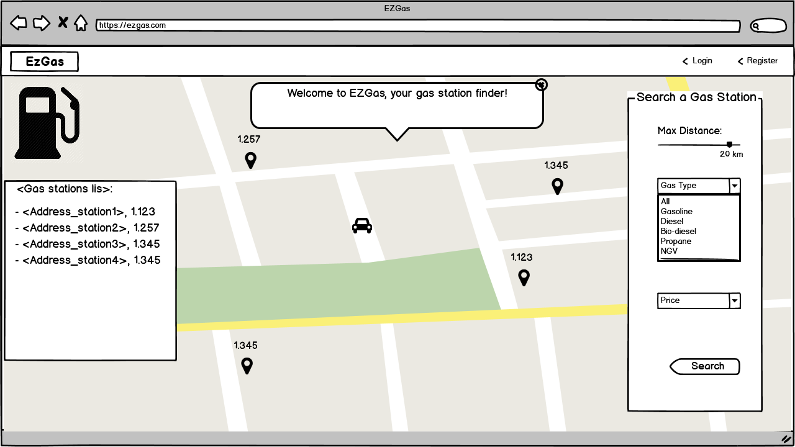
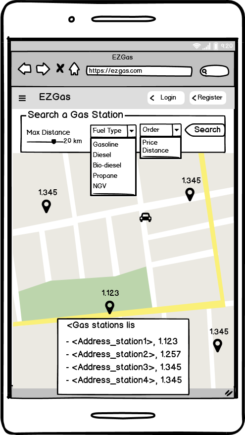

The user can choose if order by price or distance. In this case the user has chosen to order by price, then he/she can see in the left side of the window the list of gas stations ordered by price.

### 1.2 Selecting a gas station

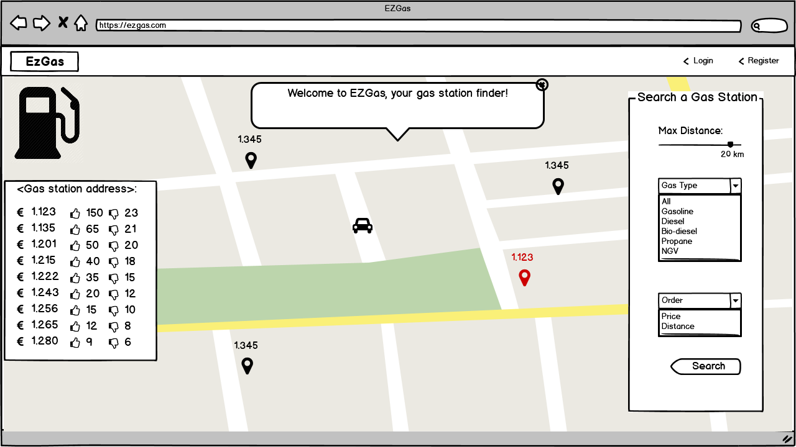
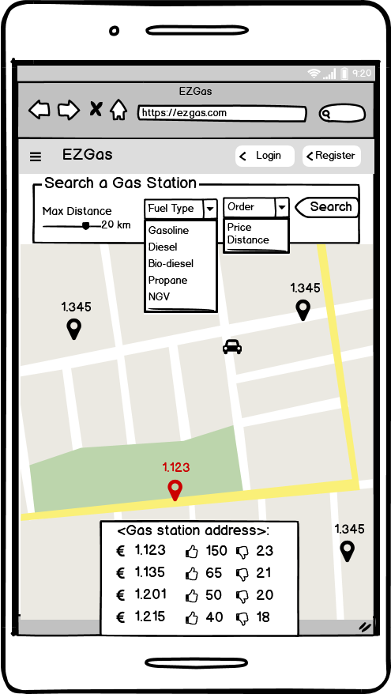

The user selected one gas station (the red one) and he/she can see the list of the prices of that station on the left side of the window (sorted by positive votes).

## 2. Login

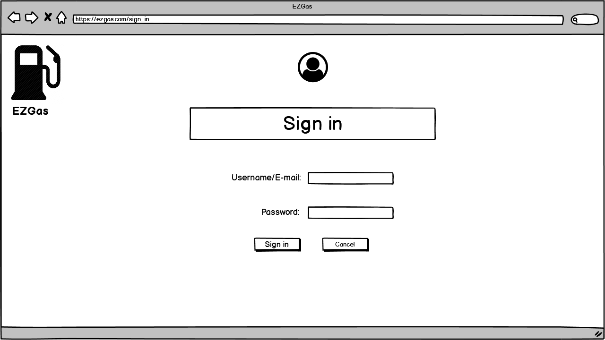

## 3. Create a new account

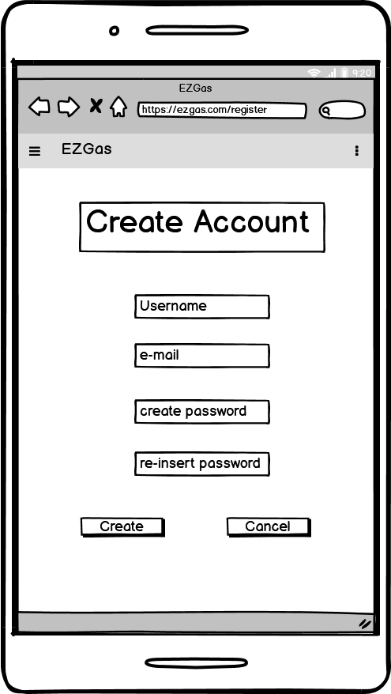

# Authenticated user view

## 4. Homepage

### 4.1 First view

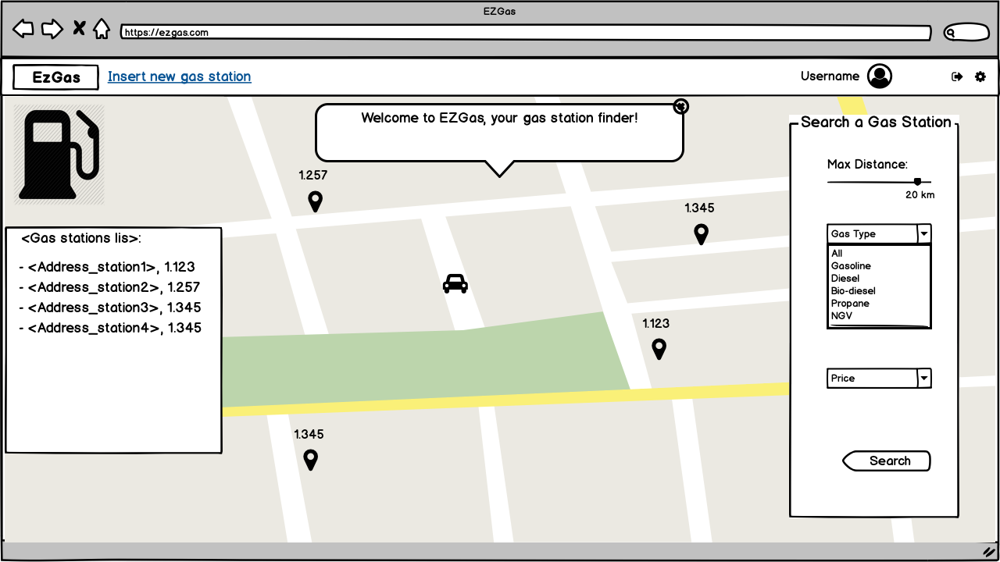
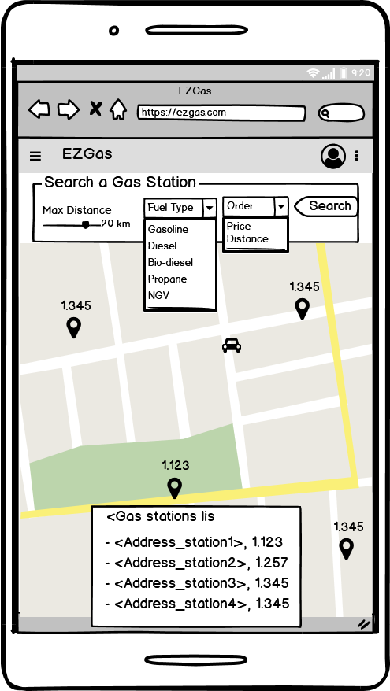

The user can choose if order by price or distance (in this case by price), but also he/she can insert new gas station by the link in the top bar because is authenticated.

### 4.2 Selecting a gas station

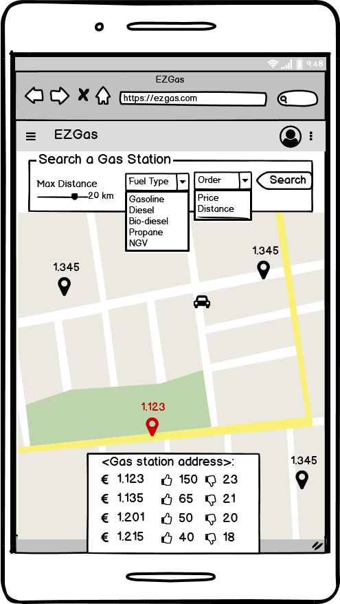

The user selected one gas station like the image above (see [1.2](#1.2-selecting-a-gas-station)). The only difference is that here user is authenticated, for that reason there is the possibility to insert a new gas station.

## 5. Gas station reached

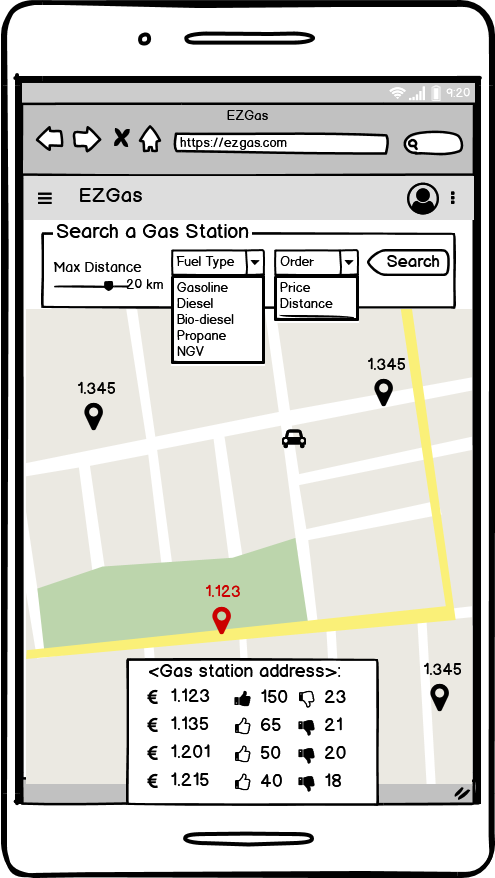

The authenticated user reached the gas station and he/she can insert a new price or he/she can vote one of the existing prices. If the authenticated user votes a price, this price receives one positive vote more while all the others receive a negative vote.

## 6. Record a new price

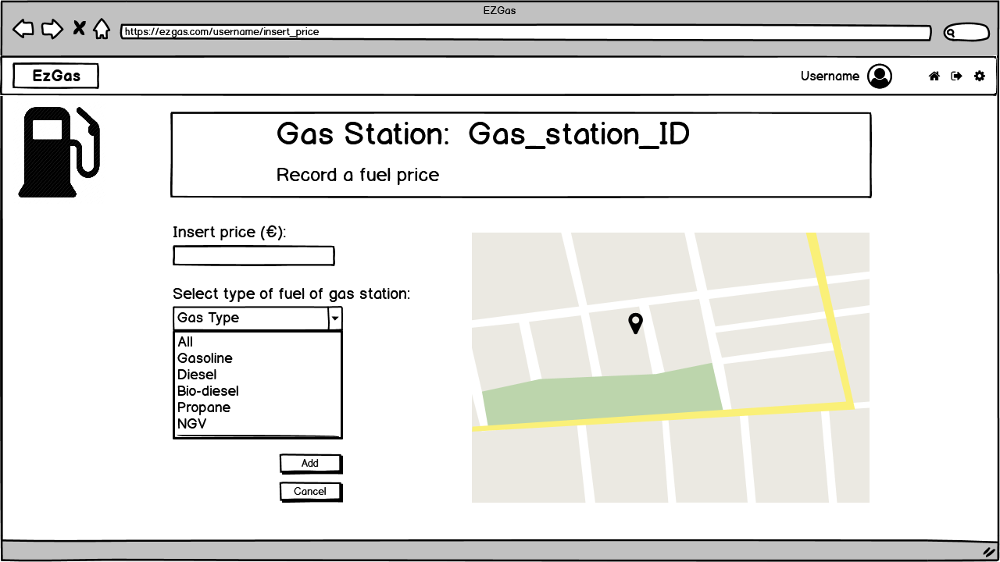
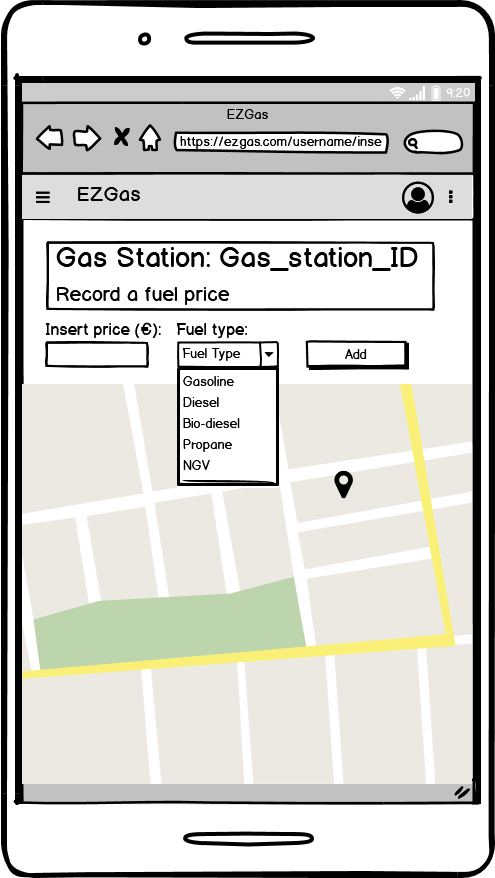

When the authenticated user selects "insert a new price", he/she can insert the price of the gas station reached about the fuel type selected before in the search form (see [4.1](#4.1-first-view)).

## 7. Insert a new gas station

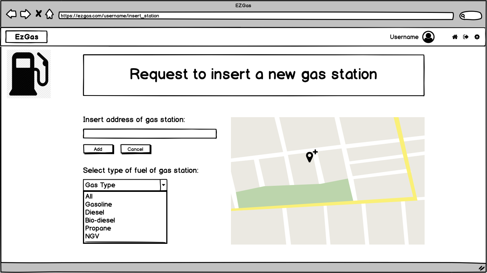
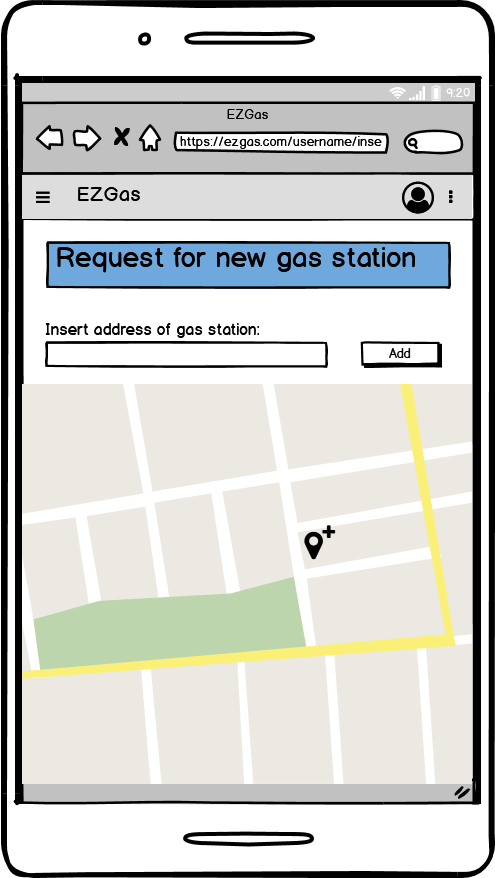

When the authenticated user selects "insert new gas station", he/she can notify a new gas station by its address and selecting its fuel type/s. The current authenticated user position will be used for the gas station position on the map.

# Administrator

## 8. Login

The login window for the administrator can be the same as the one a user uses (see [2.](#2.-login)).

## 9. Accept or reject gas station requests

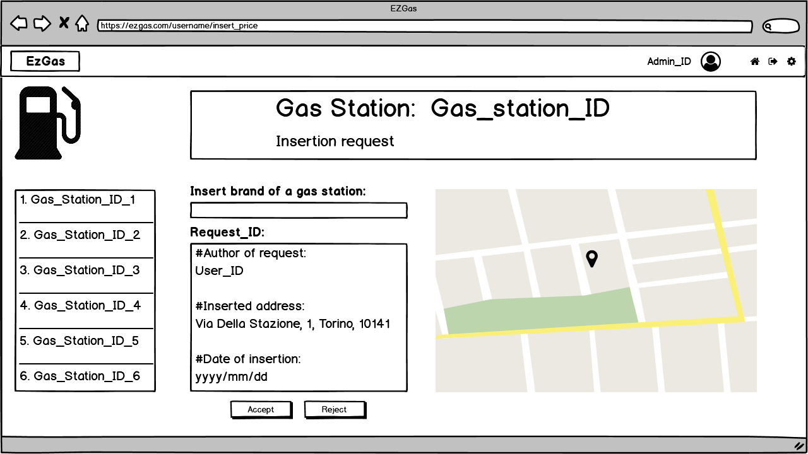
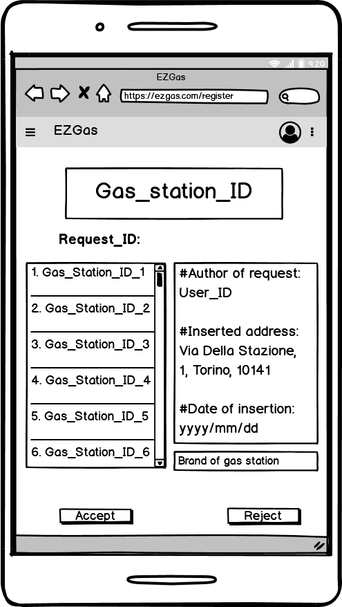
The administrator can select from the left list one gas station insert request and after that he/she can accept or reject this request.

# Mobile version differences

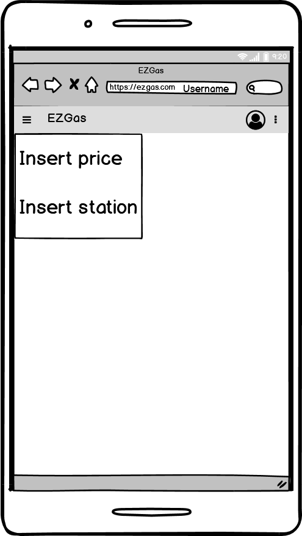
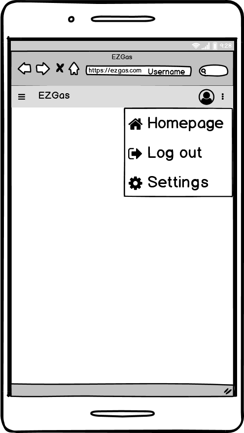