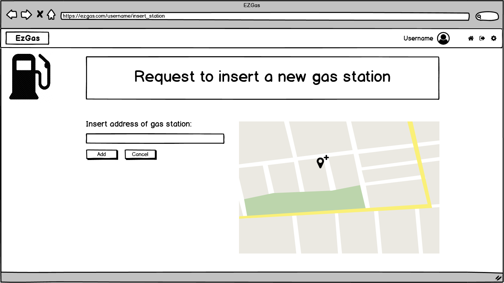

# Graphical User Interface Prototype

Authors: Group 12

Date: 14/04/2020

Version: 1

\<Report here the GUI that you propose. You are free to organize it as you prefer. A suggested presentation matches the Use cases and scenarios defined in the Requirement document. The GUI can be shown as a sequence of graphical files (jpg, png)  >

# Contents
- [User view](#user-view)
    + [1. Homepage](#1-homepage)
        + [1.1 First view](#11-first-view)
        + [1.2 Selecting a gas station](#12-selecting-a-gas-station)
    + [2. Login](#2-login)
    + [3. Create a new account](#3-create-a-new-account)
- [Authenticated user view](#authenticated-user-view)
    + [4. Homepage](#4-homepage)
        + [4.1 First view](#41-first-view)
        + [4.2 Selecting a gas station](#42-selecting-a-gas-station)
    + [5. Gas station reached](#5-gas-station-reached)
    + [6. Record a new price](#6-record-a-new-price)
    + [7. Insert a new gas station](#7-insert-a-new-gas-station)
- [Administrator view](#administrator-view)
    + [8. Login](#8-login)
    + [9. Accept or reject gas station requests](#9-accept-or-reject-gas-station-requests)
- [Mobile version differences](#mobile-version-differences)
# User view

## 1. Homepage

### 1.1 First view

This is the homepage of our application. Any user, even if he/she doesn't have an account, can perform a search of a gas station. He/she can choose if he/she wants to order the gas station found after the search in the window that pops up (on the left in web version and down in telephone version) by price or distance. In this case displayed in the example the user has chosen to order by price.

### 1.2 Selecting a gas station

Between the gas station displayed on the map the user can select (portrayed in the map as one) and he/she can see the list of the prices of that station on the left side of the window (down in the mobile version), sorted by positive votes.

## 2. Login

If the user wants to perform other operation, like insertion of prices or gas stations, he/she can log into his/her account by inserting the credentials defined in at the creation of the account.

## 3. Create a new account

The user can create an account inside the application by simply choosing a username and a password to confirm twice and inserting a mail connected to the account for security.

# Authenticated user view

## 4. Homepage

### 4.1 First view

This is the homepage of our application for authenticated user. The graphic is equal to the one of the normal user, but there is the additional button operation available which enables the user to perform a request to insert a new gas station into the application's database.
The search is performed in the same way as the normal user and the gas station are also diplayed in the same price order in the pop up window on the left (or down in mobile version)

### 4.2 Selecting a gas station

Same as the normal user (see [1.2](#1.2-selecting-a-gas-station)), the authenticated user can select a specific gas station (portayed as red)between the gas station displayed on the maps and he/she can see the list of the prices of that station on the left side of the window (down in the mobile version), sorted by positive votes. The only difference is that in this case, since the user is authenticated he has the posssibility to insert a new gas station.

## 5. Gas station reached

When an authenticated user reaches the specific chosen gas station, he/she can perform different operations:
- he/she can insert a new fuel price connected to that station;
- he/she can vote one of the existing prices. 

If the authenticated user votes a price, the selected price's positive vote is increased by one, while to all the others the negative vote is increased by one.

## 6. Record a new price

When an authenticated user selects "insert a new price", he/she can insert the price of a fuel connected to the gas station reached. He/she must select to what type of fuel he/she wants to add a price, and then must specify the price.

## 7. Insert a new gas station

When the authenticated user selects "insert new gas station", he/she can notify the presence of a new gas station by inserting its address in the specific box.

# Administrator

## 8. Login

The login window for the administrator is the same as the one of the users (see [2.](#2.-login)).

## 9. Accept or reject gas station requests

The administrator can see on the list on the left all the gas station request received. When he/she selects one anther window pops up next to the list showing all the details of the request. The administrator must check whether the gas station really exists. If it does the admin must insert the brand and accept the request and the gas station will be inserted in the database. In case the gas station is not really in that position he/she can reject the request.

# Mobile version differences

In the mobile version the *"insert price"* and *"insert gas station"* buttons are in the menu on the top left corner, while the *"log in"*, *"log out"* and *"settings"* are on the menu in the top right corner.